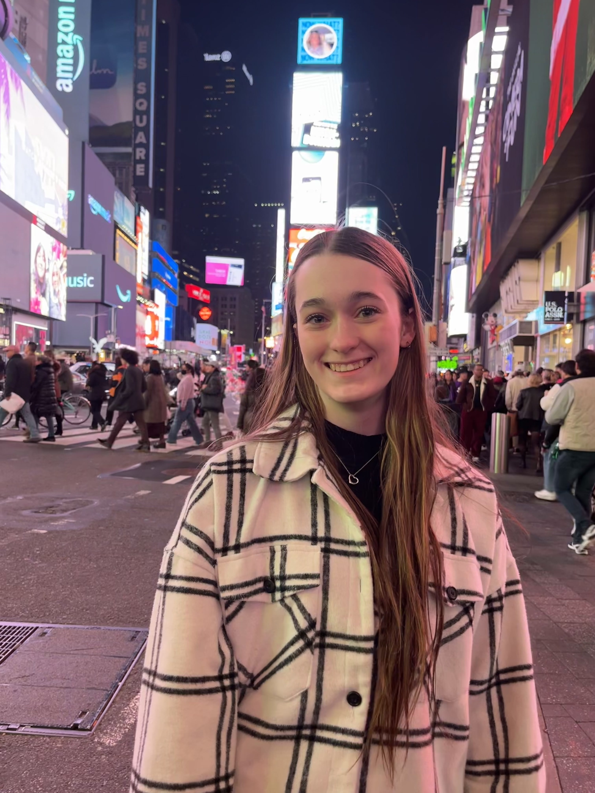

## About Me

I'm a Mechanical Engineer passionate about creating robotic systems that push the limits of what people and machines can do. I aim to work on robotics and autonomous systems that expand what's currently possible, combining mechanical design, actuation, controls, and autonomy to bring complex ideas to life.

I have extensive experience designing underwater robotic systems through my work with CUAUV, Cornell's Autonomous Underwater Vehicle project team. My most recent work includes developing a patent-pending fiber optic end effector for composite manufacturing at Lockheed Martin. I'm currently part of Cornell's Autonomous Systems Lab, where I'm designing the mechanical systems, controls, and computer vision for an underwater autonomous soft robotic fish.

### Education
**Cornell University**
- **B.S. in Mechanical Engineering** | Expected December 2025
  - Dyson Business Minor | GPA 3.6
- **M.Eng in Mechanical Engineering** | Expected December 2026
  - Robotics Concentration

### Technical Skills
SolidWorks • Fusion 360 • CATIA V5 • Rhino • Python • C++ • C • MATLAB • ROS • HTML • FEA • CNC Machining • 3D Printing • Laser Cutting • Composites • Soldering

### Featured Experience
- **Lockheed Martin** - Blades Manufacturing Engineering Intern (Summer 2025)
  - Developed patent-pending fiber optic sensor extrusion system for composite manufacturing
- **Tiffany & Co** - Manufacturing & Process Engineering Intern (Summer 2024)
  - Designed laser cutting process saving $60k/year in production costs
- **CUAUV** - Mechanical Subteam Lead (Oct 2022 - Present)
  - Leading design of autonomous underwater vehicle for international competition

### Leadership
- **Order of Omega Honor Society** - President (Sept 2025 - Present)
- **Tri Delta (Alpha Beta Chapter)** - Director of Member Finances (Jan 2024 - Present)
  - Managing $600K annual budget for the chapter
- **Impact Dance Troupe** - Treasurer (Aug 2022 - Present)

## Explore My Work

### Projects
- [Robotics Patent Sikorsky - Fiber Optic Sensor System](robotics-patent-sikorsky)
- [Tiffany & Co - Manufacturing Engineering](tiffany-co)
- [EmPRise Lab - Robotic Tactile Sensing](emprise-lab)
- [Autonomous Systems Lab - Underwater Soft Robotic Eel](autonomous-systems-lab)
- [CUAUV - Autonomous Underwater Vehicle](cuauv)

### Coursework
- [Microcontrollers: ECE 4760](ece4760)
- [Foundations of Robotics: CS 4750 (ROS)](cs4750)
- [Fast Robots: ECE 4160/5160](fast-robots)
- [Mechatronics: MAE 3780](mechatronics)
- [Ethics Portfolio: MAE 4300](MAE4300)
- [Blade Design: MAE 4272](MAE4272)

### Contact
- Email: [seb353@cornell.edu](mailto:seb353@cornell.edu)
- Phone: (513) 240-6462
- [LinkedIn](https://www.linkedin.com/in/sarah-grace-brown-82084a263/)
- [GitHub Portfolio](https://github.com/Cornell-MAE-UG/spring-2025-portfolio-sgb1443)
